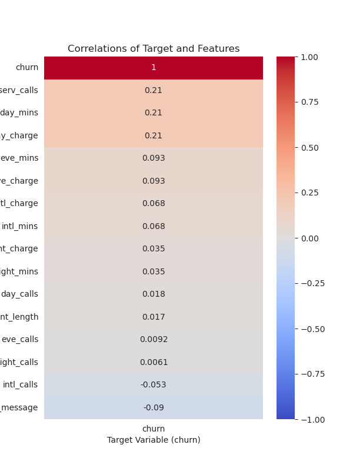
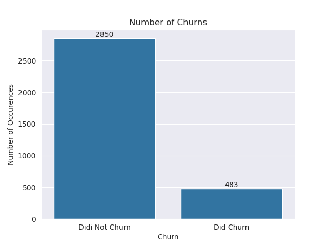
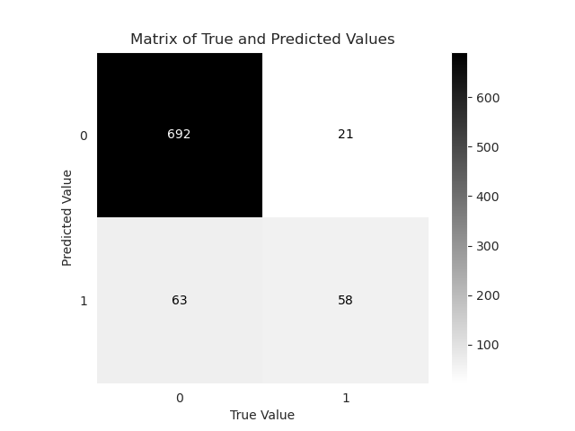

## Objective: 
Churning refers to individuals that unsubscribe from a service. The goal of this project is to create a predictive model that that classifies customers as potential churners, or as non-churners based on usage patterns. This is going to be particularly useful for service providers trying to retain their customer base to minimize subscription losses. 

---

## PART 1: Data Cleaning
Data Cleaning was super simple, as there were no missing values, and there was only one dtype that wouldn't work with machine learning. To change the dtype I ran this line of code:
```python
# changing dtype with the replace method
df['churn'] = df['churn'].replace({False : 0, True : 1})
```
This code uses the replace method to change the columns dtypes. I first selected the columns I was trying to change `df['churn']`, then I added the `.replace()` method at the end of the in order to change the dtypes. Next, I feed replace a dictionary `{False : 0, True : 1}`, when it sees the values False in the column, it will be replaced with 0, True will be replaced with 1. Lastly I saved the results by making the column a variable.

---
## PART 2: Exploratory Data Analysis (EDA)
#### Visual 1:

this is a Heatmap which shows the correlation coefficients of all the features with the target variable `churn`. Important as it helps us decide which features to use for modeling

---
#### Visual 2:

shows the number of individuals, based on whether they did or did not churn on their cellphone provider. Shows us that the vast-majority of people do not churn on their cell phone providers

---
#### Visual 3:

shows us a scatter plot comparing the cost of a call based on wether they called in the eveining or during the day, and it groups that by wether the caller churned or didn't churn. Shows us a highly motivating factor for wether someone will churn on a cellphone provider, being cost. people that have expensive calls in the evening and during the day, seem to be the most likely individuals to churn.

---
#### Visual 4:

another scatterplot, comparing the amount of minutes somebody used for a call, but wether it was during the day or in the evening, and the graph also groups the individuals based on wether they churned or didn't churn. Shows us that individuals who spend a lot of time on their phone, during the day and the evening, are the most likely to churn. Also important considering our previous graph, as we can assume that individuals who spend lots of time on calls also have expensive call costs 

---
## PART 3: Modeling
### Selection
I decided to use the KNearestNeighbors Classifier, as it is what I am used to for doing classification problems

---
### Performance

| Model             | R²       |Basline|
|-------------------|----------|-----------|
| KNeighborsClassifier |89.928 %|85.508 %|
- Because our model did better has a better score than the basline, we can assume that our model has good performance
---
### Confusion Matrix

- shows us that how many values our model was able to correctly guess. we have mostly True Negatives (people that won't churn). We want to reduce the amount of False Negatives (people that we predict won't churn, but did actually churn) which we did do, showing us the success of our model.
---
## Recommendations + Conclusion
my main recommendation for cell phone providers would be...
  - Offer discounts to individuals that either make lengthy calls, or pay a lot for their calls

I served my purpose in this analysis by...
  - making the data suitable for modeling
  - making visualizations to understand how I could make my model
  - making a model that makes accurate predictions, while addressing what our biggest predictive cause would be, and why my model doesn't suffer from that issue